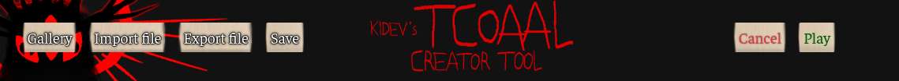
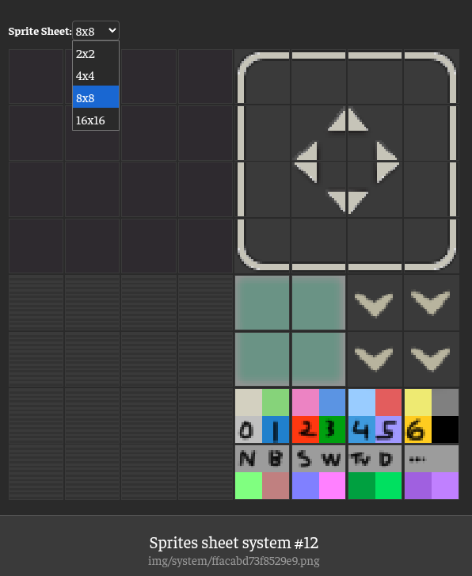

# Create your own TCOAAL scenes
Create fake sequences of gameplay animations, dialogs, choices, interactions... all of this from your browser without having to download anything. You can literally recreate the entire game with this tool! It includes tools to record, share... Nothing else than the game files are required: everything is rebuilt using the game assets and animating/layering them.  

> The video linked goes throught most of the features, examples, and explain how to compose using the tool (create new assets using the ones exisiting).  
> But if you want to tinker with it, watch from your browser and play with the sequences in the editor, simply click the links and select your game folder. After a small loading time, click the '▶' button on the top left and enjoy!  
> - [The introduction of the game](https://tcoaal.kidev.org/index.html?use=introduction)  
> - [❤️☀️💔](https://tcoaal.kidev.org/index.html?use=win)  

## Dialog viewer
This is where you'll end up when clicking a view link!
 

On the top left there is menu (**use tab to hide/show it**):

| Icon       | Action                                                                      |
| ---------- | --------------------------------------------------------------------------- |
| **🛠**     | Open the dialog editor                                                      |
| **🗂**     | Open the presets menu to select pre-made sequences                          |
| **♫**      | Mute the audio                                                              |
| **▶**      | Autoplay the sequence automatically. Right click to change autoplay settings |
| **⟲**      | Restart the sequence                                                        |
| **⬅**      | Move to previous scene in the sequence                                      |
| **0 / 20** | Shows the current scene in the sequence. Click on it to jump to any scene   |
| **➡**      | Move to next scene in the sequence                                          |
| **🖼**     | Take a screenshot                                                           |
| **📽**     | Record a video of the sequence. Right click to change recording settings    |

There are also keyboard shortcuts:

| Key                | Action             |
| ------------------ | ------------------ |
| **←**              | Previous scene     |
| **→/SPACE/Click**  | Next scene         |
| **TAB**            | Show/Hide the menu |  

## Dialog editor  
Here is where you can create/edit your own sequences! There are tons of features to recreate any frame of the game, and shortcuts to make it easier to create from the browser.  

### The top menu
 

| Button         | Action                                                                                                                                                                  |
| -------------- | ----------------------------------------------------------------------------------------------------------------------------------------------------------------------- |
| **Gallery**    | Opens the gallery containing all the game assets                                                                                                                        |
| **Share link** | Copies a (very long) link to your clipboard: you can give it to anyone to share your current sequence!                                                                  |
| **Save**       | Save the sequence you are working on to your browser, so you don't lose your work by mistake. Right click to erase the currently saved one (there is a confirm window) |
| **Cancel**     | Cancel the changes made, and return to the viewer                                                                                                                       |
| **Play**       | Move to the viewer with the changes applied                                                                                                                             |  

### Configuration  
Here you can set general settings of the whole sequence. The reset button sets every option back to its default value.  
   
**Show controls** Display the viewer menu by default or not  
**Show dialog arrow** Display the little arrow that appear under dialogs or not  
**Glitch effect** This is an effect that can be applied to dialogs, it is not in the game. It hides text by showing random wrong letters in a color, and the correct letters in another color.  
  

### Characters  
Here you can add, edit, remove characters. You can change their name, their aliases, their color. They will be available in the next block. The reset button removes all characters.  
  

### Scenes  
Here you create each scene one by one. The reset button erases all scenes.  

#### Scene ordering
- Each scene is played one by one, one after the other, starting from the top (scene 0).
- Each scene is inside a collapsible menu, only one is displayed at a time. You can use **TAB** to move to the next scene while keeping the same sub-menus open (useful for fast editions of the same value on multiple scenes).
- When collapsed, the speaker and its text are displayed. When hovering, the numbering is shown. On the right, '+' means that you can expand the menu, '-' that you can hide it. The buttons are:

| Icon  | Action                                                                      |
| ----- | --------------------------------------------------------------------------- |
| **↓** | Swap the scene with the next one in the order                               |
| **↑** | Swap the scene with the previous one in the order                           |
| **⎘** | Add a new scene by duplicating the current scene, and add it right after    |
| **✕** | Delete the scene                                                            |

- Click on the scene to expand it. Each scene can be configured using 5 groups (Basic Settings, Visual Assets, Audio, Timing, Choices and effects). There is a preview to help you see the changes you make in real time.  

#### Basic settings  
Here are the most common options for a scene:  
  

**Speaker** Who is talking? There are two special characters:  
- Narrator: No name will be shown, text will be white  
- Notification: No name will be shown, dialog box will be centered (used when picking up objects for example)  
**Line 1** First line of dialog. Quotes are added automatically correctly  
**Line 2** Second line of dialog. Quotes are added automatically correctly  
**Effects**  
- Glitch speaker will apply the glitch effect on the speaker name  
- Demon talk will uSe tHe eNtItY fOrMaTtInG  
- Center dialog will center the dialog box  
- Hide dialog box will hide the background of the dialog box (used once by Andrew, rare)  
   
#### Visual assets  
Here you set background and portraits. You can select from the gallery, from a web link, or from a local file (but this will make the sequence impossible to share with other, be warned: avoid local). You can use the **〃** button to copy the values of the previous scene visual assets.  
  
**Background** Set the background. If not used, background is black.  
**Bust left/right** Set the portraits. If not used, they are not displayed.  

#### Audio  
Select a sound effect and background music. You can preview the sounds in editor, and you can use the **〃** button to copy the values of the previous scene audio.  
  
**Sound effect** Will play once, at volume, after delay (ms), with given pitch and speed.  
**Background** Will play continuously at volume, with given pitch and speed. Note that if the background music is the same as the previous scene, it will not cut between scenes and just keep playing.  

#### Timing  
  
This defines how visual elements of scenes link together (background image, dialog box, portraits). The order to display is: wait delay in, fade in, fade out, wait delay out. You can use negative values to perform a cross fade between images. So if scene 1 use fade out -100, and scene 2 use fade in -100, the two will blend together, instead of fading to black, then fading to the new image. You can use presets to help.  

#### Choices and effects  
Here you can create a shake screen effect, and add fake choices  
  
**Shake** Will shake the screen after delay, for duration. Intensity of 1 is common.  
**Choices** You can create as many options as you want. The selected option will be the one selected in the animation. The animation will start at the first choice, and move one by one, spending choice speed on each option, and end up on the selected option. Then it'll select it (sounds are included in the animation).  

## Gallery

The gallery allows you to look through all the game assets. If you open it from the main menu, I'll call it the **Asset viewer**. From here, you can download the assets individually or all at once in a ZIP file. **The ZIP file also includes the cropped versions!** If you open it from the editor, I'll call it the **Gallery**. From there, you cannot download, but you can **Use** assets: when the editor shows a button 'Select from gallery', clicking on it opens the gallery. Then pressing **Use** will use that asset in the editor. 

### Images

**Portraits** Contains the characters busts, you can sort by character name. The character 'Effects' is meant to be overlayed on top (for example bruises) using the **Compositor** (detailed in next block)...  
**Game sprites** Contains the game sprites sheets. They are automatically cut to easily select each sprite individually. You also can select multiple sprites and create a GIF with a custom speed. You can also animate sprites (which can also be animated on their own) on top of everything else in the **Compositor**, detailed in next block)  
  
**System sprites** Same as game sprites, but for a special sheet, you have the ability to select the cut size of sprites
  
**Backgrounds** These are all the backgrounds in the game. In the preview list they are cropped to make it easier to search thumbnails, and you can click on the **original**/**cropped** button to change in the big preview. Some are overlays: they are meant to be put on top of other backgrounds to make it appear 3D (so characters can be behind objects, like furniture...). This can be replicated using the **Compositor**, detailed in the next block.
  
**Pictures** Those are the main game arts, they are also cropped in preview, and can be overlayed.  
  
**Misc** There you will see the main menu art, the game icon, and mainly all the compositions you are able to create using the **Compositor**, detailed in next block!  

There are shortcuts:
| Key                | Action             |
| ------------------ | ------------------ |
| **←→**              | Previous/next asset in the list     |
| **ENTER**  | Download/Use          |
| **TAB**            | Move category (Portraits, Backgrounds...) |
| **↑↓**           | Move selected character in Portraits OR Previous/next sprite in sprites sheets |
| **SPACE**           | Cropped/original version |  
| **ESC**           | Exit the gallery only |  

### Audio

In each, you can preview the sound. You can also change its volume, its speed and pitch on the fly (done by the game to change the mood of songs a lot).  

**Background songs** The game music
**Background sounds** Some ambient
**Soundeffects/Event sounds** Sound effects and misc
**Misc** Only appears when you export sound tracks from the **Compositor**

There are shortcuts:
| Key                | Action             |
| ------------------ | ------------------ |
| **←→**              | Previous/next asset in the list     |
| **ENTER**  | Download/Use          |
| **TAB**            | Move category (Portraits, Backgrounds...) |
| **SPACE**           | Play/pause current sound |
| **ESC**           | Exit the gallery only |  

## Compositor
The compositor is where you create new assets by layering existing ones! Many scenes in the game combine multiple images together: overlay backgrounds to create depth, add effects on top of portraits (like bruises or blushes), or layer characters to create scenes. Instead of manually doing this in an image editor, the compositor lets you create these combinations directly in your browser, save them, and reuse them in your sequences.  
The video is best way to understand it, it's not hard to use but it has a lot of features, and that can be confusing.  

You can add any asset into the compositor by clicking the **Add to compositor** button.


All your saved compositions are stored in **Gallery → Images → Misc** or **Gallery → Audio → Misc**, and can be used just like any other game asset!

### The compositor interface

### Layer controls
Each layer has several controls on the left panel:


| Icon             | Action                                                                   |
| ---------------- | ------------------------------------------------------------------------ |
| **☑/☐**          | Hide/show the layer (toggle visibility)                                 |
| **⬆**            | Move layer up in z-order (brings it forward visually)                   |
| **⬇**            | Move layer down in z-order (sends it backward visually)                 |
| **🗑**           | Delete the layer                                                         |
| **⥅**            | Add a copy of this layer right after it                                  |
| **Layer name**   | Click to rename the layer (instead of default names like "KF 1" or "A1") |

For layers with keyframes, you'll also see:

| Element                       | Action                                                                            |
| ----------------------------- | --------------------------------------------------------------------------------- |
| **KF 2** (or KF 3, KF 4...)   | Tabs to switch between keyframes. Click to edit that keyframe's position and properties. |
| **+ Add layer as keyframe**   | Convert another layer into a keyframe of this layer                              |
| **⏏ Eject keyframe as layer** | Convert a keyframe back into a separate layer                                    |

**Position controls:**
Each layer shows **X/Y** input fields for precise positioning. You can also drag layers directly on the canvas for visual positioning.

### Creating a simple composition
Let's say you want to combine two background images (a base background and an overlay to add depth):

1. Open the **Gallery** from the editor or go to gallery mode (`?mode=gallery`)
2. Find an image you want to use as the base (for example, a background)
3. Click on it to add it as the first layer in the compositor
4. Browse and find another image to layer on top (for example, a background overlay or a character portrait)
5. Click on it to add it as a new layer
6. Drag the layer on the canvas to position it, or use the **X/Y** inputs for precise positioning
7. Use the **⬆/⬇** buttons to adjust which layers appear in front or behind
8. Toggle layer visibility with **☑/☐** to see how each layer contributes
9. Click on the layer name to rename it (optional, but helpful for organization)
10. When you're happy with the result, type a composition name at the bottom and click **Export PNG**

Your new composition is now saved and available in **Gallery → Misc**!

### Creating animations
You can animate layers to create movement! For example, make a character walk across the screen, or create a pulsing effect.

. Should show the Time input field and demonstrate the same layer in different positions across keyframes.)

**To create a simple animation:**
1. Add a layer to the compositor (like a character sprite)
2. The layer shows as **KF 1** (keyframe 1). Set its initial position.
3. Click **⥅** to add a new keyframe, or manually add one. A new tab **KF 2** appears.
4. Click on the **KF 2** tab to edit the second keyframe
5. Move the layer to a new position on the canvas
6. Adjust the **Time** value (in milliseconds) to control the duration between keyframes
7. Add more keyframes by clicking **⥅** again to create complex motion paths
8. Click the **▶** play button at the top to preview your animation
9. Click **Export GIF** to save your animation!

The visual preview on the canvas shows the current keyframe's state. Switch between keyframe tabs to see how the layer moves through the animation.

**Combining sprite sheets with keyframe animations:**
You can animate sprite sheets (like walking animations) AND move them around at the same time! When you select a sprite sheet asset with multiple frames, it automatically animates through the frames. Add keyframes to also move it across the canvas, creating a walking character that actually moves!

### Adding sounds to compositions
Make your animations more dynamic by adding sound effects or music!


1. In the compositor, switch to the **Audio** tab in the gallery
2. Find a sound effect or background music
3. Click to add it as an audio track (it appears in the layer list as **A1**, **A2**, etc.)
4. Click on the audio track name to rename it (optional)
5. Set the **Time** value to control when the sound plays (in milliseconds from the start)
6. Adjust **Speed** to change playback rate (0.5x for slow, 2.0x for fast)
7. Add multiple audio tracks to create complex soundscapes
8. Use **☑/☐** to mute/unmute audio tracks while previewing
9. Click the **▶** play button to preview with audio

**Note:** Audio tracks are saved separately in **Gallery → Misc** in the audio section. Audio keyframes are stored in the composition data but audio is not embedded in exported GIFs (that's a GIF format limitation).

### Advanced: Converting layers to keyframes
If you've added multiple layers with different assets, you can merge them into a single animated layer for flip-book style animations:

1. Add several layers with different assets (for example, different character expressions)
2. On a layer you want to convert, click the **+ Add layer as keyframe** button
3. Select the target layer to merge into
4. The source layer becomes a new keyframe of the target layer, creating frame-by-frame animation
5. Use **⏏ Eject keyframe as layer** if you need to convert a keyframe back into a separate layer

This is perfect for creating hand-drawn style animations where each frame is a completely different image!

### Exporting your creations


**Export PNG** Saves the current frame as a static image. Perfect for layered backgrounds or portrait compositions.
**Export GIF** Creates an animated GIF from all keyframes and sprite animations. The duration is automatically calculated from your keyframe timings, and exports at around 30fps for smooth playback.

**Important:** GIF export requires running on a local web server (not `file://` protocol) due to browser limitations.

## Dialog editor (ADVANCED MENU)  
Right click on **Share link** to make reveal the **Import file** and **Export file** buttons. Those are for advanced users, and allow you to export/import the sequence using the JavaScript code directly. The share link option is basically a file export encoded in the URL. The advantage of using those is that the code is properly formatted and not minimized. It can also be easier to modify the sequence directly by editing the JS file. This is what a sequence file look like:  
```js
function setupScene() {
        dialogFramework
        .addScene({
            image: "gallery:Pictures/pictures_769.png",
            speaker: "Andy",
            line1: "Leyley, I don't--... want to.",
            dialogFadeInTime: 100,
            dialogFadeOutTime: 100,
            imageFadeInTime: 100,
            imageFadeOutTime: -100,
            dialogDelayIn: 500,
            backgroundMusic: "gallery:Background songs/jealous_doll.ogg"
        })
        .addScene({
            image: "gallery:Misc/andyleyley.png",
            speaker: "Leyley",
            line1: "Well, I do.",
            dialogFadeInTime: 100,
            imageFadeInTime: -100,
            dialogDelayIn: 500,
            backgroundMusic: "gallery:Background songs/jealous_doll.ogg"
        });

        dialogFramework
        .setCompositions([{
                "id": "comp_1761270447251_v9dzr96xv",
                "name": "andyleyley",
                "width": 1296,
                "height": 720,
                "layers": [{
                        "type": "background",
                        "galleryRef": "gallery:Pictures/pictures_769.png",
                        "x": 0,
                        "y": 0,
                        "width": 1296,
                        "height": 720,
                        "visible": true,
                        "zIndex": 0
                },{
                        "type": "background",
                        "galleryRef": "gallery:Pictures/pictures_109.png",
                        "x": 0,
                        "y": 0,
                        "width": 1296,
                        "height": 720,
                        "visible": true,
                        "zIndex": 1
                }]}
        ]);
}
```
In the opening scene, first there is an image of Andy, then Leyley appears on the same image. In the game assets, those are two different images, and the game displays them on top of each other. That's what the `setCompositions` part is describing here. It describes how to create the custom composition `gallery:Misc/andyleyley.png` that is used in the 2nd scene ("Well, I do"). This is the most simple case of a composition. With the feature you can create animations and much more  

