# Create your own TCOAAL scenes
Create fake sequences of gameplay animations, dialogs, choices, interactions... all of this from your browser without having to download anything. You can literally recreate the entire game with this tool! It includes tools to record, share... Nothing else than the game files are required: everything is rebuilt using the game assets and animating/layering them.  

**Two iconic scenes from the game to showcase most features of the tool: click to play!**  
> [The very first scene of TCOAAL Chapter 1](index.html?use=introduction&autoplay)  
> [Penny for your thoughts? The infamous scene from Chapter 2](index.html?use=win&autoplay)  

You can also try to beat the two levels of my game **Ashley on Duty** if you are not into creating animations!


## Dialog viewer
This is where you'll end up when clicking a view link!
 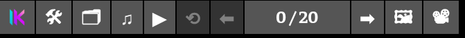

On the top left there is menu (**use tab to hide/show it**):

| Icon                                                                     | Action                                                                       |
|--------------------------------------------------------------------------|------------------------------------------------------------------------------|
|  | Return to the home page                                                      |
| **🛠**                                                                   | Open the dialog editor                                                       |
| **🗂**                                                                   | Open the presets menu to select pre-made sequences                           |
| **♫**                                                                    | Mute the audio                                                               |
| **▶**                                                                    | Autoplay the sequence automatically. Right click to change autoplay settings |
| **⟲**                                                                    | Restart the sequence                                                         |
| **⬅**                                                                    | Move to previous scene in the sequence                                       |
| **0 / 20**                                                               | Shows the current scene in the sequence. Click on it to jump to any scene    |
| **➡**                                                                    | Move to next scene in the sequence                                           |
| **🖼**                                                                   | Take a screenshot                                                            |
| **📽**                                                                   | Record a video of the sequence. Right click to change recording settings     |

There are also keyboard shortcuts:

| Key                | Action             |
| ------------------ | ------------------ |
| **←**              | Previous scene     |
| **→/SPACE/Click**  | Next scene         |
| **TAB**            | Show/Hide the menu |  

## Dialog editor  
Here is where you can create/edit your own sequences! There are tons of features to recreate any frame of the game, and shortcuts to make it easier to create from the browser.  

### The top menu
 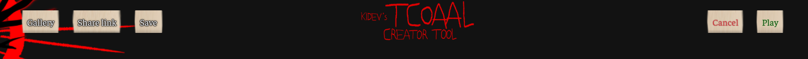

| Button         | Action                                                                                                                                                                  |
| -------------- | ----------------------------------------------------------------------------------------------------------------------------------------------------------------------- |
| **Gallery**    | Opens the gallery containing all the game assets                                                                                                                        |
| **Share link** | Copies a (very long) link to your clipboard: you can give it to anyone to share your current sequence!                                                                  |
| **Save**       | Save the sequence you are working on to your browser, so you don't lose your work by mistake. Right click to erase the currently saved one (there is a confirm window) |
| **Cancel**     | Cancel the changes made, and return to the viewer                                                                                                                       |
| **Play**       | Move to the viewer with the changes applied                                                                                                                             |  

### Configuration  
Here you can set general settings of the whole sequence. The reset button sets every option back to its default value.  
 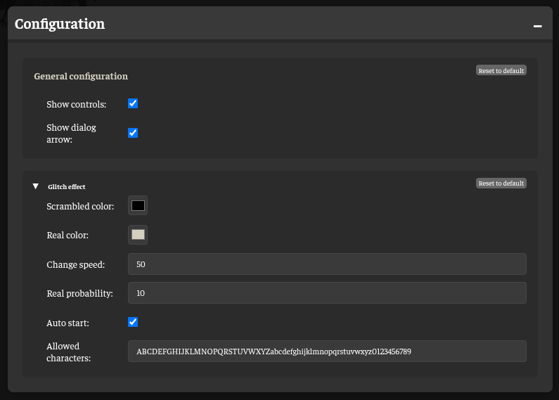  
- **Show controls**   
Display the viewer menu by default or not  

- **Show dialog arrow**  
Display the little arrow that appear under dialogs or not  

- **Glitch effect**  
This is an effect that can be applied to dialogs, it is not in the game. It hides text by showing random wrong letters in a color, and the correct letters in another color.  
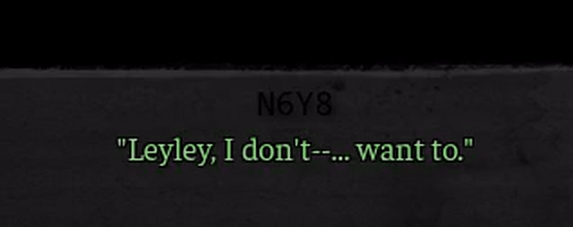  

### Characters  
Here you can add, edit, remove characters. You can change their name, their aliases, their color. They will be available in the next block. The reset button removes all characters.  
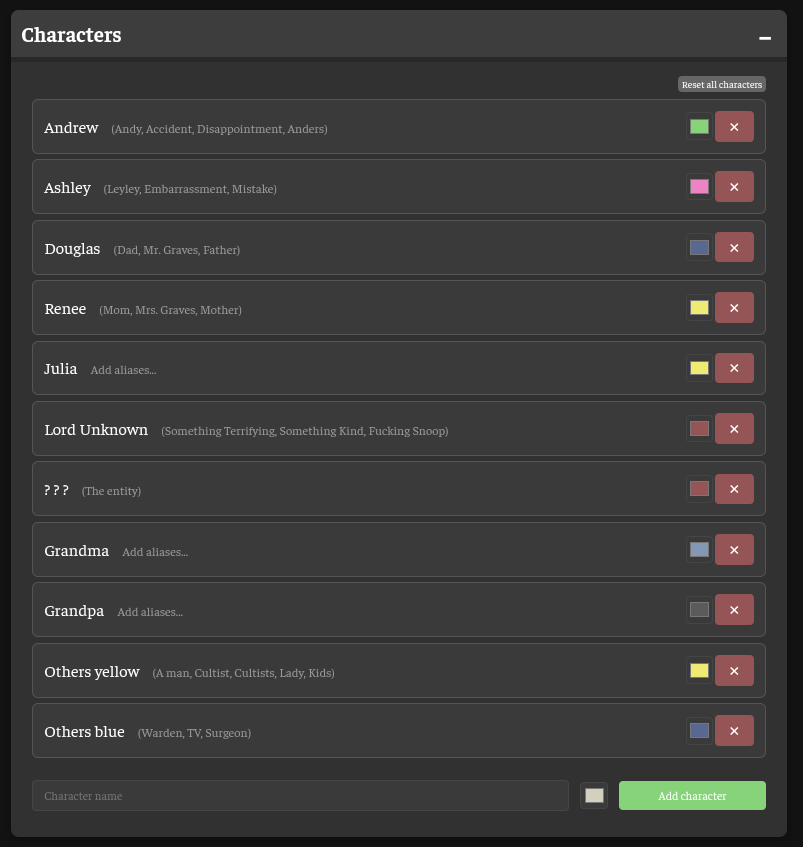  

### Scenes  
Here you create each scene one by one. The reset button erases all scenes.  

#### Scene ordering
- Each scene is played one by one, one after the other, starting from the top (scene 0).
- Each scene is inside a collapsible menu, only one is displayed at a time. You can use **TAB** to move to the next scene while keeping the same sub-menus open (useful for fast editions of the same value on multiple scenes).
- When collapsed, the speaker and its text are displayed. When hovering, the numbering is shown. On the right, '+' means that you can expand the menu, '-' that you can hide it. The buttons are:

| Icon  | Action                                                                      |
| ----- | --------------------------------------------------------------------------- |
| **↓** | Swap the scene with the next one in the order                               |
| **↑** | Swap the scene with the previous one in the order                           |
| **⎘** | Add a new scene by duplicating the current scene, and add it right after    |
| **✕** | Delete the scene                                                            |

- Click on the scene to expand it. Each scene can be configured using 5 groups (Basic Settings, Visual Assets, Audio, Timing, Choices and effects). There is a preview to help you see the changes you make in real time.  

#### Basic settings  
Here are the most common options for a scene:  
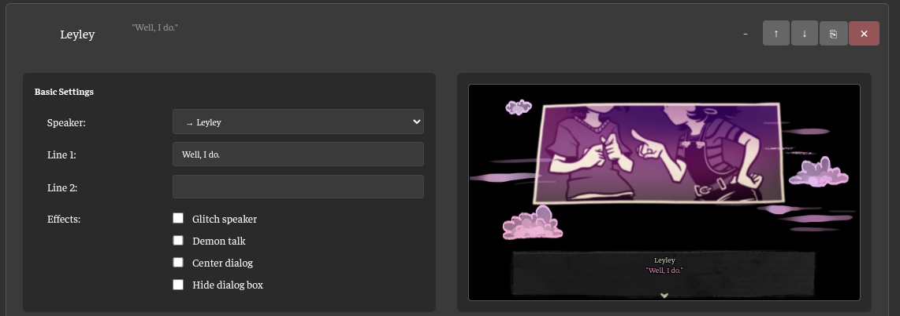  

- **Speaker** Who is talking? There are two special characters:  
  - Narrator: No name will be shown, text will be white  
  - Notification: No name will be shown, dialog box will be centered (used when picking up objects for example)  
- **Line 1** and **Line 2**
  Both lines of dialog. Quotes are added automatically correctly to mimic the game  
  You can use special formatting here, it will show up in real time formatted inside the preview
  - Basic formatting: `<b>bold</b>`, `<i>italic</i>`, `<u>underline</u>`
  - Large text: `<l>text</l>` or `<l size="2">text</l>` (custom size)
  - Inline glitch effects: `<glitch>text</glitch>` with optional attributes:
    - `color="red"` Set real text color
    - `scrambled="blue"` Set scrambled text color
    - `speed="50"` Set animation speed (ms)
  Example: `<u>Well</u> <b>Mr.</b> <i>Andy</i><l size=2> I DO</l> <glitch>DUMBASS</glitch>`  
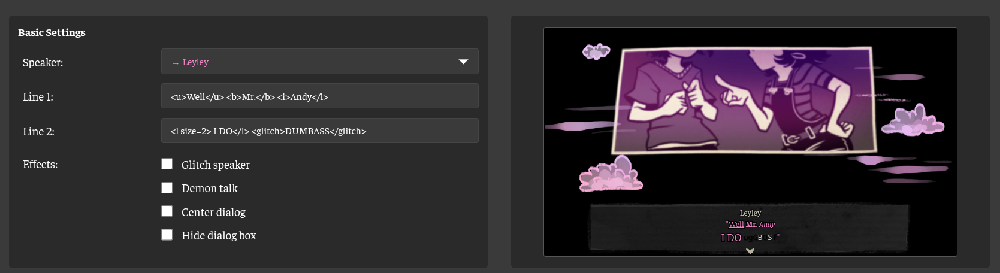  

- **Effects**  
  - Glitch speaker will apply the glitch effect on the speaker name  
  - Demon talk will uSe tHe eNtItY fOrMaTtInG  
  - Center dialog will center the dialog box  
  - Hide dialog box will hide the background of the dialog box (used once by Andrew, rare)  
   
#### Visual assets  
Here you set background and portraits. You can select from the gallery, from a web link, or from a local file (but this will make the sequence impossible to share with other, be warned: avoid local). You can use the **〃** button to copy the values of the previous scene visual assets.  
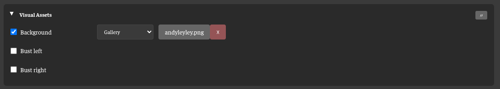  


- **Background**  
Set the background. If not used, background is black.
For animated backgrounds (GIF), you can also select repeat **➊** (once) or to **∞** (loop). This will mostly affect the autoplay feature of the viewer. `Loop` animations are great for background things (like fire, or the eyes in visions), and `Once` is better for when you have a character move somewhere, a real scene.
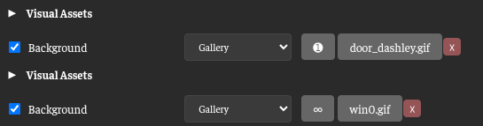  

- **Bust left/right**  
Set the portraits. If not used, they are not displayed.  

#### Audio  
Select a sound effect and background music. You can preview the sounds in editor, and you can use the **〃** button to copy the values of the previous scene audio.  
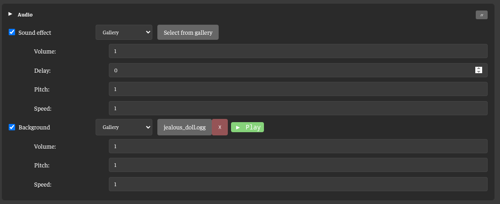  
- **Sound effect**  
Will play once, at volume, after delay (ms), with given pitch and speed.  

- **Background**  
Will play continuously at volume, with given pitch and speed. Note that if the background music is the same as the previous scene, it will not cut between scenes and just keep playing.  

#### Timing  
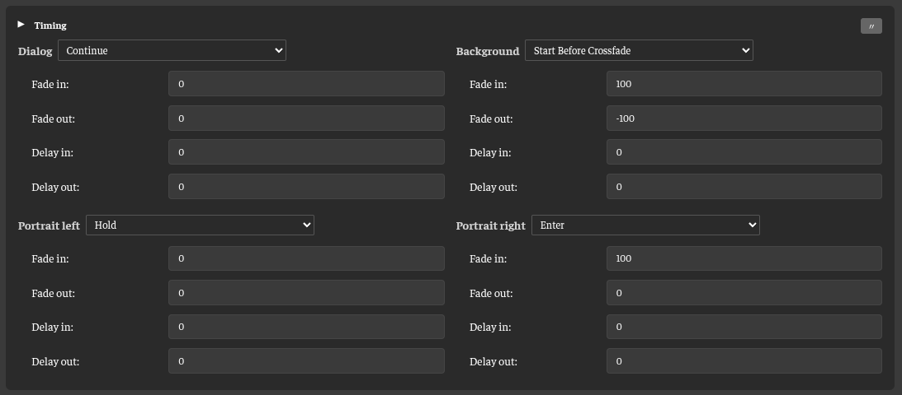  
This defines how visual elements of scenes link together (background image, dialog box, portraits). The order to display is: wait delay in, fade in, fade out, wait delay out. You can use negative values to perform a cross fade between images. So if scene 1 use fade out -100, and scene 2 use fade in -100, the two will blend together, instead of fading to black, then fading to the new image. You can use presets to help.  

#### Choices and effects  
Here you can create a shake screen effect, and add fake choices  
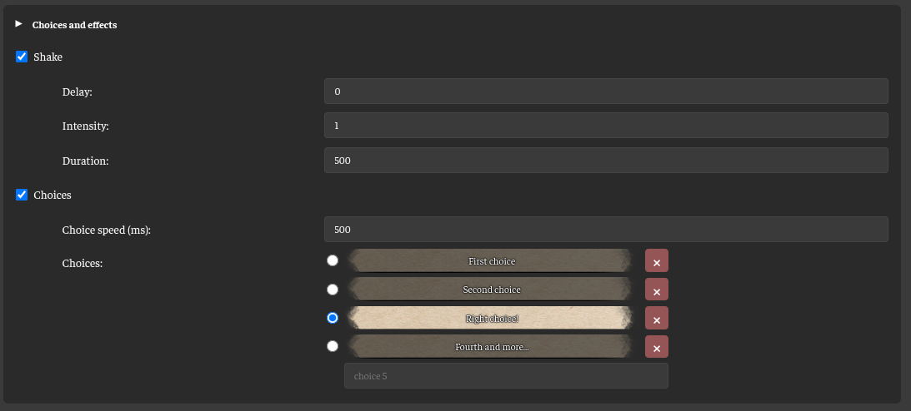  
- **Shake**  
Will shake the screen after delay, for duration. Intensity of 1 is common.  

- **Choices**  
You can create as many options as you want. The selected option will be the one selected in the animation. The animation will start at the first choice, and move one by one, spending choice speed on each option, and end up on the selected option. Then it'll select it (sounds are included in the animation).  

### Share creations

> _**To community content creators:**_
> You are free to use anything you create with this website for free, forever. You don't have to, but if you can mention the website somewhere when you share your creations, it'll help new people find the tools and will grow the creators community!  
> I don't earn nor spend anything else than my time on this tool, so sharing is always appreciated!  
> If you have requests for new features, suggestions or bug fixes, I'll try to answer my DMs at @kidev on Discord and Reddit  

If you click on the **Share link** button in the top menu, you'll get a unique link that you can share with anyone, and they will be able to play it on their computer (they just need the game). The links generated are long, and Reddit may refuse them, so it's advised you shorten them using [TinyURL](https://tinyurl.com) or a similar service. I'm working on a dedicated service for this website, but it's not really even started yet.  

You can also right click on **Share link** to reveal the **Import file** and **Export file** buttons.  
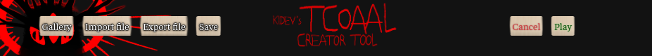  
Those are for advanced users, and allow you to export/import the sequence using the JavaScript code directly. The share link option is basically a file export encoded in the URL. The advantage of using those is that the code is properly formatted and not minimized. It can also be easier to modify the sequence directly by editing the JS file.  
For example, in the opening scene, first there is an image of Andy, then Leyley appears on the same image. In the game assets, those are two different images, and the game displays them on top of each other. That's what the `setCompositions` part is describing here. It describes how to create the custom composition `gallery:Misc/andyleyley.png` that is used in the 2nd scene ("Well, I do"). This is the most simple case of a composition. With the feature you can create animations and much more (see the **Compositor** chapter).
This is what the sequence file look like for the scene described:  
<details>
<summary><b>Show exported code file</b></summary>

```js
function setupScene() {
        dialogFramework
        .addScene({
            image: "gallery:Pictures/pictures_769.png",
            speaker: "Andy",
            line1: "Leyley, I don't--... want to.",
            dialogFadeInTime: 100,
            dialogFadeOutTime: 100,
            imageFadeInTime: 100,
            imageFadeOutTime: -100,
            dialogDelayIn: 500,
            backgroundMusic: "gallery:Background songs/jealous_doll.ogg"
        })
        .addScene({
            image: "gallery:Misc/andyleyley.png",
            speaker: "Leyley",
            line1: "Well, I do.",
            dialogFadeInTime: 100,
            imageFadeInTime: -100,
            dialogDelayIn: 500,
            backgroundMusic: "gallery:Background songs/jealous_doll.ogg"
        });

        dialogFramework
        .setCompositions([{
                "id": "comp_1761270447251_v9dzr96xv",
                "name": "andyleyley",
                "width": 1296,
                "height": 720,
                "layers": [{
                        "type": "background",
                        "galleryRef": "gallery:Pictures/pictures_769.png",
                        "x": 0,
                        "y": 0,
                        "width": 1296,
                        "height": 720,
                        "visible": true,
                        "zIndex": 0
                },{
                        "type": "background",
                        "galleryRef": "gallery:Pictures/pictures_109.png",
                        "x": 0,
                        "y": 0,
                        "width": 1296,
                        "height": 720,
                        "visible": true,
                        "zIndex": 1
                }]}
        ]);
}
```
</details>

## Gallery

The gallery allows you to look through all the game assets. If you open it from the main menu, I'll call it the **Asset viewer**. The first time you open it, it will crop all the relevant images in the background (you will see a progress bar). The next times, it will not happen.  
Here, you can download the assets individually or all at once in a ZIP file. **The ZIP file also includes the cropped versions!** If you open it from the editor, I'll call it the **Gallery**. From there, you cannot download, but you can **Use** assets: when the editor shows a button 'Select from gallery', clicking on it opens the gallery. Then pressing **Use** will use that asset in the editor.  
Use right click on an asset to add it to favorites and find it easily, making it appear first in its category.
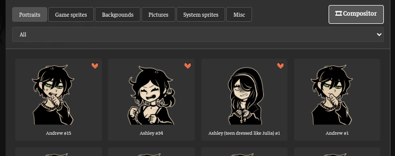


### Images

- **Portraits**  
Contains the characters busts, you can sort by character name. The character 'Effects' is meant to be overlayed on top (for example bruises) using the **Compositor** (detailed in next block)...  

- **Game sprites**  
Contains the game sprites sheets. They are automatically cut to easily select each sprite individually. You also can select multiple sprites and create a GIF with a custom speed. You can also animate sprites (which can also be animated on their own) on top of everything else in the **Compositor**, detailed in next block)  
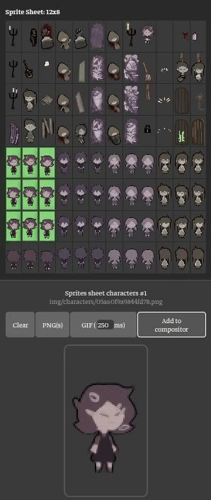  

- **System sprites**  
Same as game sprites, but for a special sheet, you have the ability to select the cut size of sprites
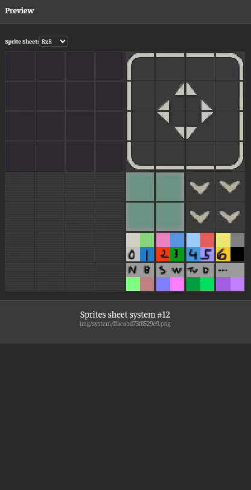  

- **Backgrounds**  
These are all the backgrounds in the game. In the preview list they are cropped to make it easier to search thumbnails, and you can click on the **original**/**cropped** button to change in the big preview. Some are overlays: they are meant to be put on top of other backgrounds to make it appear 3D (so characters can be behind objects, like furniture...). This can be replicated using the **Compositor**, detailed in the next block.
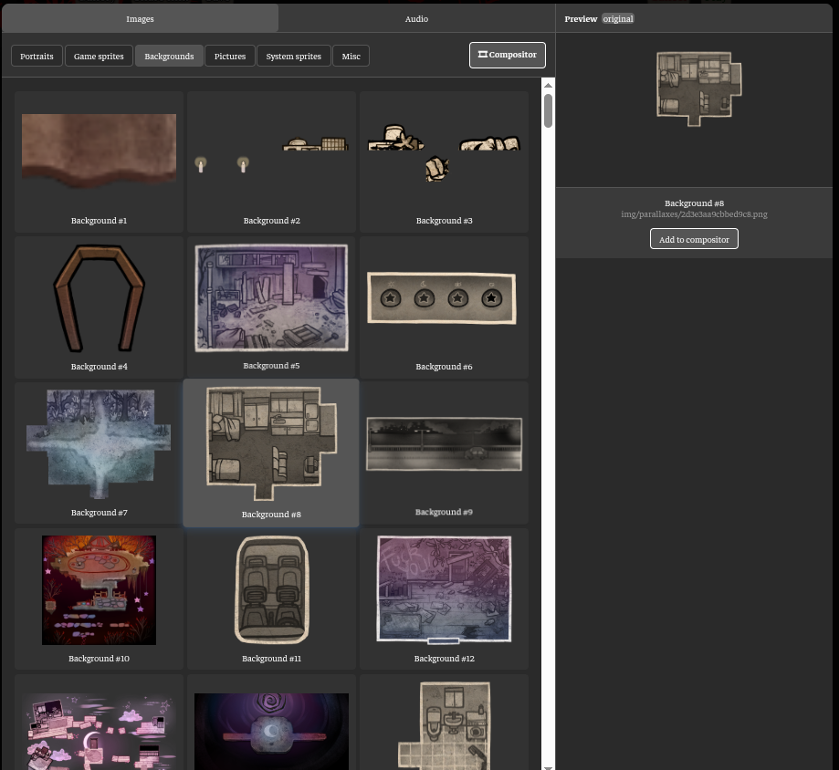  

- **Pictures**  
Those are the main game arts, they are also cropped in preview, and can be overlayed.  
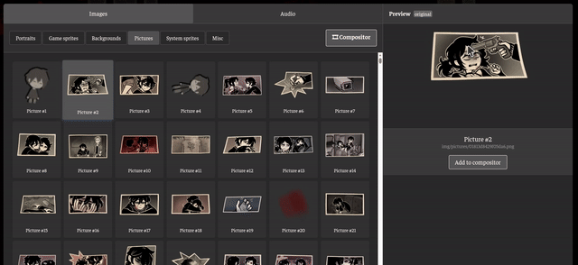  

- **Misc**  
There you will see the main menu art, the game icon, and mainly all the compositions you are able to create using the **Compositor**, detailed in next block!  


There are shortcuts:
| Key                | Action             |
| ------------------ | ------------------ |
| **←→**              | Previous/next asset in the list     |
| **ENTER**  | Download/Use          |
| **TAB**            | Move category (Portraits, Backgrounds...) |
| **↑↓**           | Move selected character in Portraits OR Previous/next sprite in sprites sheets |
| **SPACE**           | Cropped/original version |  
| **ESC**           | Exit the gallery only |  
| **Right click**   | Add to favorites |

### Audio

In each, you can preview the sound. You can also change its volume, its speed and pitch on the fly (done by the game to change the mood of songs a lot).  
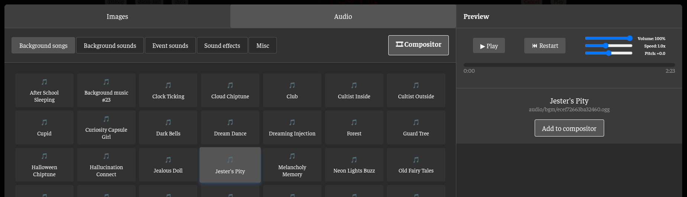

- **Background songs**  
The game music

- **Background sounds**  
Some ambient

- **Sound effects/Event sounds**  
Sound effects and misc

- **Misc**  
Only appears when you export sounds tracks from the **Compositor**

There are shortcuts:
| Key                | Action             |
| ------------------ | ------------------ |
| **←→**              | Previous/next asset in the list     |
| **ENTER**  | Download/Use          |
| **TAB**            | Move category (Portraits, Backgrounds...) |
| **SPACE**           | Play/pause current sound |
| **ESC**           | Exit the gallery only |  

## Compositor
The compositor is where you create new assets by layering existing ones! Many scenes in the game combine multiple images together: overlay backgrounds to create depth, add effects on top of portraits (like bruises or blushes), or layer characters to create scenes. Instead of manually doing this in an image editor, the compositor lets you create these combinations directly in your browser, save them, and reuse them in your sequences.  

The following general video about the **Compositor** is the best way to grasp all the features. Otherwise, the chapter have different videos for each topic in particular, along with explanations.  


You can add any asset into the compositor by clicking the **Add to compositor**. 
All your saved compositions are stored in **Gallery → Images → Misc** or **Gallery → Audio → Misc**, and can be used just like any other game asset!
When adding a composition to the compositor, you'll get access to all the original assets (useful for editing/improving existing compositions).

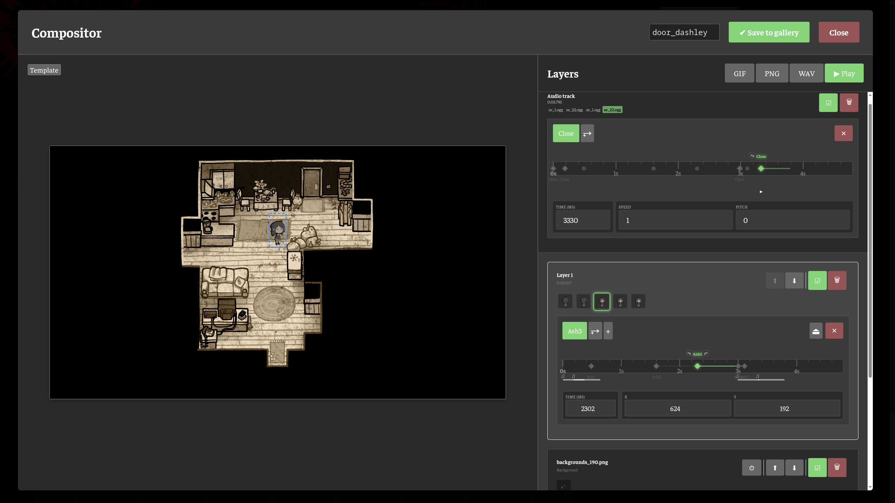

### Image layers
The most straightforward layers. They are a single asset. They can be animated GIFs, but from only one file at a time. You can place them on the canvas using coordinates or drag and drop on the preview. You can change their ordering.  

Here, the `backgrounds_190.png` will be on top of `backgrounds_263.png`, giving the possibility to character to move behind clutter (like the trash bags in the introduction of the game).  


| Icon    | Action                                                        |
|---------|---------------------------------------------------------------|
| **☑/☐** | Hide/show the layer (toggle visibility)                       |
| **🗑**  | Delete the layer                                              |
| **⬆**   | Move layer up in z-order (brings it forward visually)         |
| **⬇**   | Move layer down in z-order (sends it backward visually)       |
| **⏱**   | Add a timeline, creating a sequence layer                     |
| **X/Y** | Place the layer on the canvas (mouse on canvas works as well) |

**Drag and drop on the preview with the mouse**
You can use left mouse hold and drag to select by pixels, allowing you to select layers under others that are visible.  
You can also use the right click to select by bounding box, but it is limited by the relative depth of the layer: this is useful to select entirely invisible layers for example.  

### Sequence layers
These are layers containing a timeline. On this timeline are placed visual keyframes, and those are then played at their respective time when playing the animation. Each keyframe can be placed on the canvas using coordinates or drag and drop on the preview. 
In a sequence layer, you change your asset over time. So it can start looking left for 1s, then look right, and then walk somewhere: indeed, if they are not at the same place over time, the image is interpolated linearly.  
The duration of the animation is the duration of the longest timeline. Adding the first/last keyframe not at the extremes allows to make layers appear/disappear across the timeline (character entering/leaving room, or taking objects...) 


| Icon        | Action                                                               |
|-------------|----------------------------------------------------------------------|
| **☑/☐**     | Hide/show the layer (toggle visibility)                              |
| **🗑**      | Delete the layer                                                     |
| **⬆**       | Move layer up in z-order (brings it forward visually)                |
| **⬇**       | Move layer down in z-order (sends it backward visually)              |
| **Layer 1** | Click to rename the layer (instead of default names like "Layer 1")  |
| **⥅**       | Clone the current asset 1sec in the future                           |
| **+**       | Add an image layer as asset of for this sequence layer               |
| **⏏**       | Eject asset from this sequence layer and turn it into an image layer |
| **✕**       | Delete this asset                                                    |
| **X/Y**     | Place the layer on the canvas (mouse on canvas works as well)        |
| **TIME**    | Place the asset on the timeline                                      |
| **⥃/⥂**     | Swap the selected asset with the previous/next one on the timeline   |
| **KF 1**    | Click to rename the layer (instead of default names like "KF 1")     |

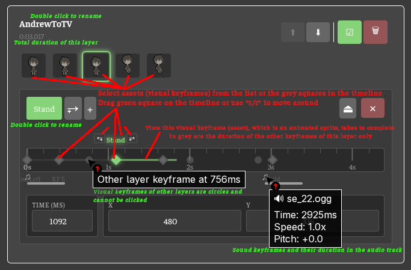


### The audio track
If you add any audio asset to the compositor, it will appear in the unique audio track, on top. They work exactly the same as sequence layers, but with sounds. And instead of placing them on the canvas, you can tweak volume/pitch/speed of each.


### Canvas size  
The canvas will, by default, resize itself to accommodate the largest imported asset. If you want to set its size manually, you can click on the **Auto** button next to the canvas size on top of the preview, and you will be able to set the canvas size manually.  
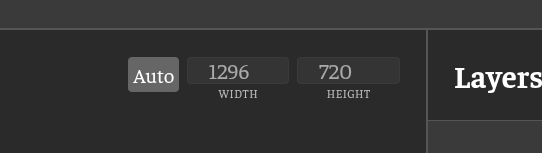  

### Template  
You have the possibility to import an image that will replace the black background of the Compositor. This template image will not be exported, even if you leave it visible when exporting. You can hide it, and remove it as you want.  
It is very useful to reproduce certain scenes in the game with lots of objects that you want precisely placed. For example, the eye animations in the visions.


### Exporting

- **Save to gallery**  
Give a name to the composition and export it directly into your gallery for usage with the editor!  
The animation will be in `Images - Misc`. If there is an audio track, it will be exported to `Audio - Misc`. They will have the same name, but different file extension  
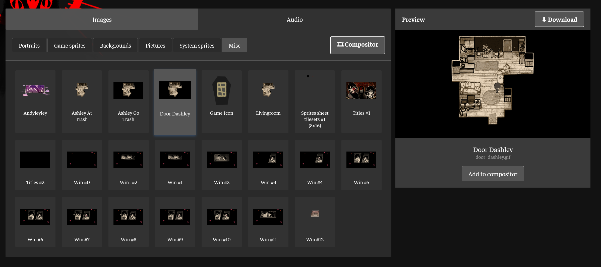  
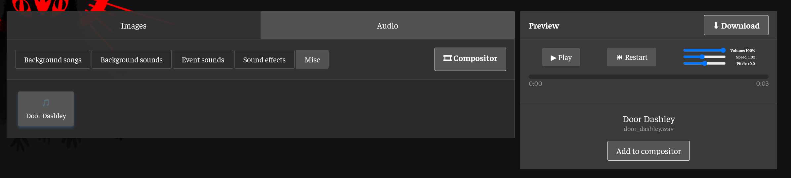  
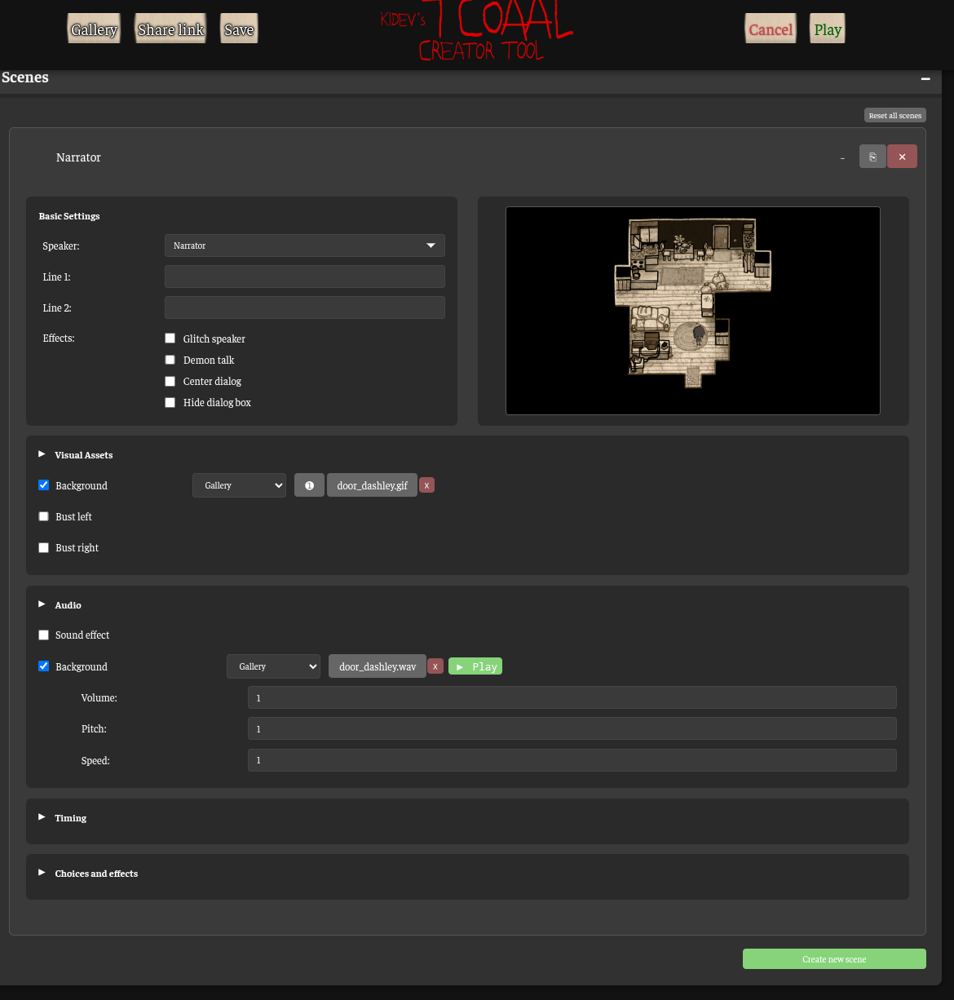  

- **Export PNG**  
Saves the current frame as a static image. Perfect for layered backgrounds or portrait compositions.

- **Export GIF**  
Creates an animated GIF from all keyframes and sprite animations. The duration is automatically calculated from your keyframe timings, and exports at around 30fps for smooth playback.

- **Export WAV** 
Creates a WAV containing the audio track